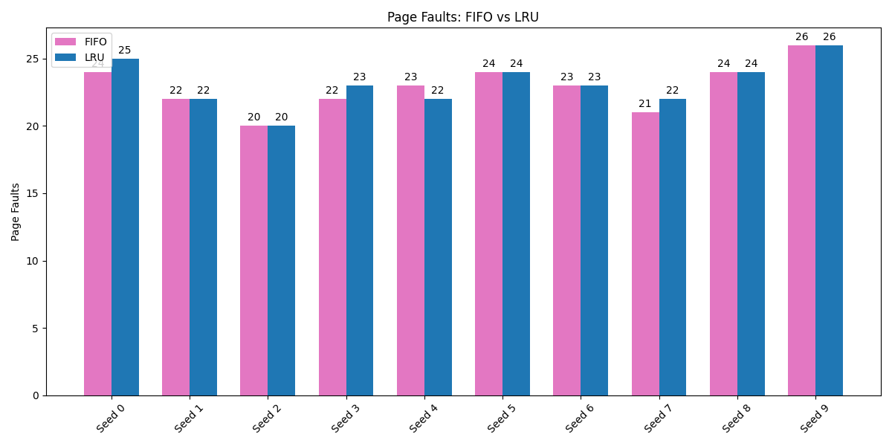
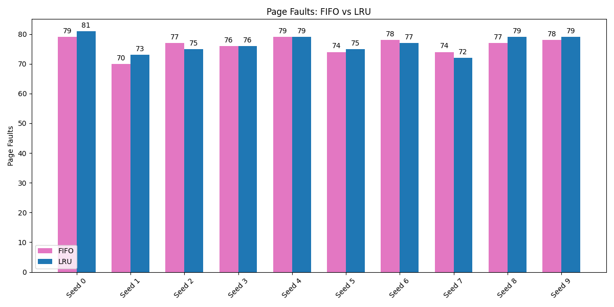
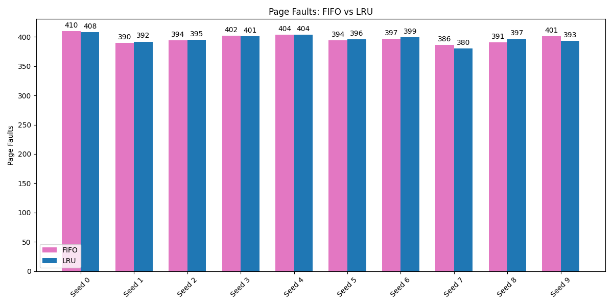
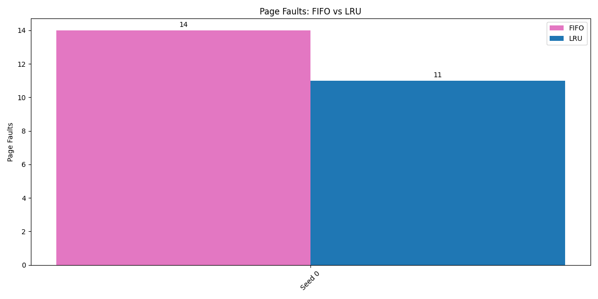

# Wprowadzenie do systemów komputerowych
Program symulacyjny dla planowania czasu procesora oraz zastępowania stron
## Symulacje algorytmów planowania czasu procesora
Do przeprowadzenia symulacji zostały wybrane algorytmy FCFS oraz SJF, ze względu na ich wyraźne różnice w działaniu, a także prostotę implementacji, która umożliwia klarowne porównanie wyników. Symulacje zostały wykonane w języku Python, do porównania oraz wizualizacji wyników zostały wykorzystane biblioteki matplotlib oraz numpy. 
### FCFS (First-Come, First-Served)
Algorytn FCFS jest znany z jego prostoty, tak jak nazwa wskazuje procesy są obsługiwane w kolejności w której pojawiły się w kolejce.
#### Zalety
- Można oszacować czas oczekiwania na podstawie kolejki
- Procesy nie są głodzone, każdy zostanie obsłużony
- Łatwa implementacja oraz zrozumienie
#### Wady
- Możliwy długi czas oczekiwania dla krótkich procesów
- Słaba średnia wydajność 
- Brak priorytetów
### SJF (Shortest Job First)
Algorytm SJF to metoda planowania procesów, która optymalizuje wykorzystanie procesora poprzez priorytetowe wykonywanie zadań o najkrótszym czasie wykonania.
#### Zalety
- Minimalizacja średniego czasu oczekiwania
- Zwiększa przepustowość systemu, częściej wykonuje krótkie zadania, zwiększając liczbę okończonych procesów
#### Wady
- Może prowadzić do głodzenia długich procesów
- Skompliwany proces przewidywania czasu wykonania
### Dane testowe
Symulacje zostały wykonane na trzech losowo wygenerowanych zbiorach danych o różnej wielkości. Poniższy kod generuje listę procesów o podanej liczbię elementów, która jest następnie wykorzystywana jako dane wejściowe dla obu algorytmów.
```
random.seed(42)
num_processes = 10
test_data = [
    Process(pid=i+1, arrival_time=random.randint(0, 10), burst_time=random.randint(1, 8))
    for i in range(num_processes)
]
```
### Wyniki
1. 10 procesów, ziarno 42 <br>
 <br>
SJF jest wyraźnie lepszy, średni czas oczekiwania oraz turnaround są znacząco niższe niż w FCFS. Czas oczekiwania jest równy czasowi odpowiedzi, ponieważ w obu algorytmach procesy czekają na swoją kolej bez przerw.
2. 100 procesów, ziarno 43 <br>
 <br>
SJF nadal przeważa chociaż różnice stają się mniej dramatyczne.
3. 10000 procesów, ziarno 44 <br>
 <br>
FCFS dalej widocznie gorzej sobie radzi niż SJF ale różnice ciągle maleją.
### Wnioski
SJF jest optymalny dla małej, średniej oraz dużej liczby procesów przy zróżnicowanych czasach wykonania. FCFS jest prostszym algorytmem ale nawet przy małym obciążeniu ma problemy z wydajnością ze względu na "efekt konwoju", blokowanie kolejki jednym długim procesem do momentu jego zakończenia.
## Symulacje algorytmów zastępowania stron
Do przeprowadzenia symulacji zostały wybrane algorytmy FIFO oraz LRU. Wybrano te metody ze względu na ich fundamentalne różnice w zarządzaniu pamięcią.
### FIFO (First In, First Out)
Algorytm FIFO jest najprostszym algorytmem zastępowania stron. Jego działanie polega na trzymaniu wszystkich stron w kolejce, najstarsza znajduje się na początku. Kiedy wszystkie ramki są zajęte, FIFO usuwa pierwszą w kolejce.
#### Zalety
- Prostota implementacji
- Niskie wymagania obliczeniowe
- Przewidywalność, zawsze zostanie usunięta najstarsza strona
#### Wady
- Nie bierze pod uwagę użycia stron, może usuwać te które są nadal potrzebne
### LRU (Least Recently Used)
LRU to algorytm który usuwa z pamięci stronę która jest od najdłuższego czasu nieużywana. Jest oparty o założenie, że strony używane dawniej są mniej potrzebne niż te, który były używane później.
#### Zalety
- Ogranicza ryzyko usunięcia potrzebnych stron
- Minimalizuje błędy strony, lepiej wykorzystuje lokalność czasową
#### Wady
- Trudniejsza implementacja od FIFO
- Rzadko używane, ale kluczowe strony mogą być usuwane
### Dane testowe
Dane testowe składają się z losowo wygenerowanych ciągów numerów stron o zmiennych parametrach aby można było porównać ze sobą algorytmu w różnych scenariuszach. Num_seeds odpowiada za ilość ziaren do porównania, num_frames określa ile stron może być jednocześnie w pamięci, a reference_length wyznacza długość wygenerowanych ciągów liczbowych.
```
num_seeds = 10
num_frames = 3
reference_length = 30
...
for seed in range(num_seeds):
    random.seed(seed)
    reference_string = [random.randint(0, 9) for _ in range(reference_length)]
    ...
```
### Wyniki
1. Liczba ramek: 3, długość ciągów: 30, liczba stron: 10, ziarno: 0-9 <br>
 <br>
2. Liczba ramek: 5, długość ciągów: 100, liczba stron: 20, ziarno: 0-9 <br>
 <br>
3. Liczba ramek: 10, długość ciągów: 500, liczba stron: 50, ziarno: 0-9 <br>
 <br>
4. Liczba ramek: 3, konkretny ciąg w kórym widoczny jest trend najczęściej używanej strony <br>
 <br>
### Wnioski
Na podstawie przeprowadzonych symulacji można zauważyć, że w przypadku losowo generowanych ciągów odwołań do stron, algorytmy FIFO i LRU osiągają bardzo zbliżone wyniki, FIFO wypada minimalnie lepiej. Wynika to najprawdopodobniej z losowości danych testowych. Jednak w sytuacji kiedy dane nie są losowe i wyraźnie występuje najczęściej używana strona, algorytm LRU pokazuje swoją przewagę.

