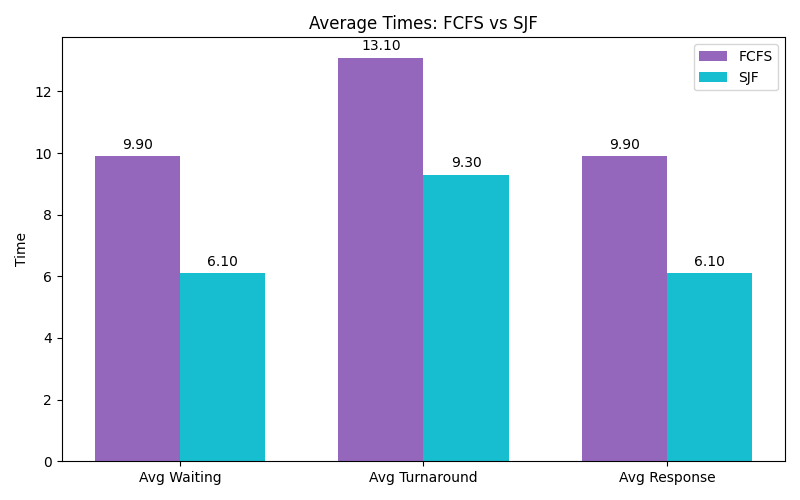
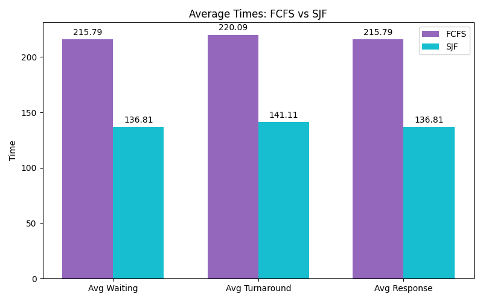
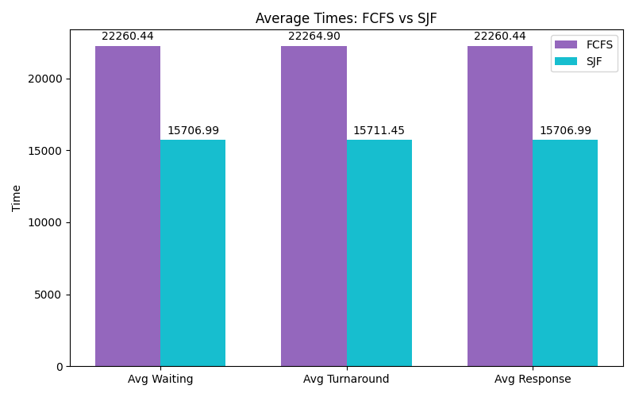

# Sprawozdanie
...
## Symulacje algorytmów planowania czasu procesora
Do przeprowadzenia symulacji zostały wybrane algorytmy FCFS oraz SJF, ze względu na ich wyraźne różnice w działaniu, a także prostotę implementacji, która umożliwia klarowne porównanie wyników. Symulacje zostały wykonane w języku Python, do porównania oraz wizualizacji wyników zostały wykorzystane biblioteki matplotlib oraz numpy. 
### FCFS (First-Come, First-Served)
Algorytn FCFS jest znany z jego prostoty, tak jak nazwa wskazuje procesy są obsługiwane w kolejności w której pojawiły się w kolejce.
#### Zalety
- Można oszacować czas oczekiwania na podstawie kolejki
- Procesy nie są głodzone, każdy zostanie obsłużony
- Łatwa implementacja oraz zrozumienie
#### Wady
- Możliwy długi czas oczekiwania dla krótkich procesów
- Słaba średnia wydajność 
- Brak priorytetów
### SJF (Shortest Job First)
Algorytm SJF to metoda planowania procesów, która optymalizuje wykorzystanie procesora poprzez priorytetowe wykonywanie zadań o najkrótszym czasie wykonania.
#### Zalety
- Minimalizacja średniego czasu oczekiwania
- Zwiększa przepustowość systemu, częściej wykonuje krótkie zadania, zwiększając liczbę okończonych procesów
#### Wady
- Może prowadzić do głodzenia długich procesów
- Skompliwany proces przewidywania czasu wykonania
### Dane testowe
Symulacje zostały wykonane na trzech losowo wygenerowanych zbiorach danych o różnej wielkości. Poniższy kod generuje listę procesów o podanej liczbię elementów, która jest następnie wykorzystywana jako dane wejściowe dla obu algorytmów.
```
random.seed(42)
num_processes = 10
test_data = [
    Process(pid=i+1, arrival_time=random.randint(0, 10), burst_time=random.randint(1, 8))
    for i in range(num_processes)
]
```
### Wyniki
1. 10 procesów

2. 100 procesów

3. 10000 procesów

## Symulacje algorytmów zastępowania stron
### FIFO (First In, First Out)
...
### LRU (Least Recently Used)
...
